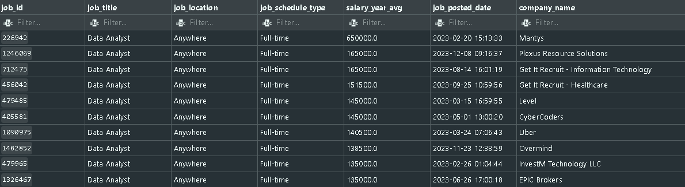
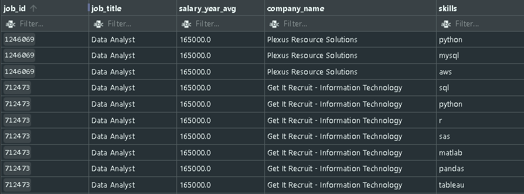
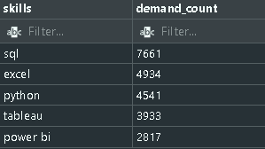
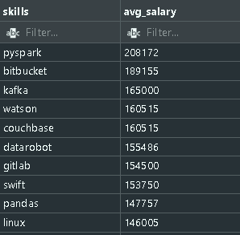
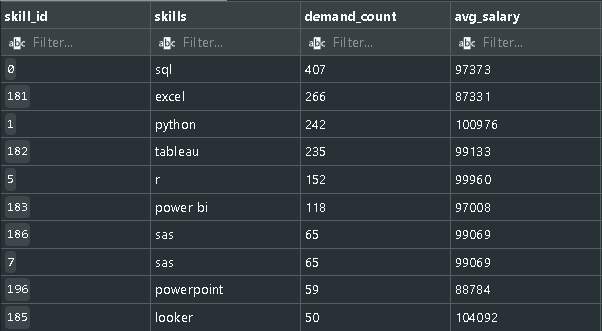

# SQL Learning Project — Data Analyst Job Market

This repository documents my learning process of SQL by analyzing the job market for **Data Analyst** roles using a real dataset of job postings, companies, and skills.

The main goal is to practice business SQL queries that answer questions like:
- What are the best paying jobs?
- What skills are most frequently required?
- What technologies are best paid?
- How to prioritize skills with a good balance between **demand** and **salary**?


---

## 📚 Learning Context

This project is inspired by the tutorial of YouTuber **Luke Barousse**:
- Video: https://www.youtube.com/watch?v=7mz73uXD9DA

Dataset and base scripts (creación/carga) used on the project are from the same source:
- Google Drive: https://drive.google.com/drive/folders/1moeWYoUtUklJO6NJdWo9OV8zWjRn0rjN

 I used PostgreSQL as my database management system, but the SQL syntax is mostly standard and can be adapted to other systems with minor adjustments.
 - I have used **VSCode IDE** with the "SQLTools" extension for writing and executing SQL queries.

> Note: The CSV files are not included in this repository due to size reasons.

---

## 🗂️ My repository structure

```bash
SQL/
├── assets/
│   ├── 1_query.png
│   ├── 2_query.png
│   ├── 3_query.png
│   ├── 4_query.png
│   └── 5_query.png
├── project_sql/
│   ├── 1_top_paying_jobs.sql
│   ├── 2_top_paying_jobs_skills.sql
│   ├── 3_top_demanded_skills.sql
│   ├── 4_top_paying_skills.sql
│   └── 5_optimal_skills.sql
└── sql_load/
    ├── 1_create_database.sql
    ├── 2_create_tables.sql
    └── 3_modify_tables.sql
```

- `assets/`: Images with query results for visualization (not the full output, just samples).
- `sql_load/`: Those are the scripts for preparing the database, tables, and initial data loading.
- `project_sql/`: Analytical queries (my learning progress).

---

## 🧱 DB preparation

### 1) Create db
Execute:
- `sql_load/1_create_database.sql`

This creates:
- `sql_course`

### 2) Create tables and relationships
Execute:
- `sql_load/2_create_tables.sql`

Main tables:
- `company_dim`: company information.
- `skills_dim`: skills catalog.
- `job_postings_fact`: job postings.
- `skills_job_dim`: bridge table between job postings and skills.

This includes:
- PK/FK for relational integrity.
- Indexes in join columns (`company_id`, `job_id`, `skill_id`) to improve performance.

### 3) Load CSVs
Execute:
- `sql_load/3_modify_tables.sql`

This file provides two approaches:
- `\copy` (recommended for local client/PSQL when there are permission issues).
- `COPY` con rutas locales (ejemplo en Windows).

---

## 🔎 Queries Analysis (`project_sql`)

## 1) Top paying jobs
File: `project_sql/1_top_paying_jobs.sql`

### What does it do?
- Filter by `job_title_short = 'Data Analyst'`.
- It only takes job postings with non-null annual salary.
- Restricts location to `Remote Jobs` or in `Bogotá, Colombia`.
- Orders by highest salary and returns the top results.

### Learned SQL here 
- `LEFT JOIN` to bring company names.
- Filters with `WHERE` and nulling control.
- `ORDER BY` + `LIMIT` for ranking.

### Business Insight
Allows to detect high salary opportunities for Data Analyst profiles in remote or Colombia.


> Those are the first 10 rows of the result, showing the job title, job location, job schedule, yearly salary, the date the job was posted, and the company name. **Note**: The query is limited, so there are more results in the full output. The same may apply to the next queries, where only a sample of the results is shown in the images for visualization purposes.

---

## 2) Required Skills On top-paying jobs
File: `project_sql/2_top_paying_jobs_skills.sql`

### What does it do?
1. Creates a CTE (`top_paying_jobs`) with the 10 highest paying job postings.
2. Joins these jobs with required skills (`skills_job_dim` + `skills_dim`).

### Learned SQL here
- `WITH` (CTE) to divide logic into clear steps.
- `INNER JOIN` multiple to resolve many-to-many relationships.

### Business Insight
Shows which tools appear in the most premium jobs (e.g., SQL, Python, Tableau, cloud, etc.), useful for prioritizing study.



---

## 3) Top demanded skills
File: `project_sql/3_top_demanded_skills.sql`

### What does it do
- Counts how many job postings require each skill (grouping by skill).
- Returns the top 5 of most demanded skills.

### Learned SQL here
- Aggregation with `COUNT()`.
- `GROUP BY` for frequency by category.

### Business Insight
Identifies the “core” of skills most demanded by the market.



---

## 4) Top paying skills
File: `project_sql/4_top_paying_skills.sql`

### What does it do
- Calculates average salary (`AVG`) by skill in Data Analyst job postings with reported salary.
- Orders from highest to lowest to see the most highly compensated skills.

### Learned SQL here
- Compensation metrics with `AVG` and `ROUND`.
- Importance of filtering `salary_year_avg IS NOT NULL`.

### Business Insight
Not always the most demanded is the best paid. This query helps to see the "salary premium" part.



---

## 5) Optimal skills (demand + salary)
File: `project_sql/5_optimal_skills.sql`

### What does it do
1. Filters relevant job postings (`filters`) for Data Analyst with salary and remote or Bogotá location.
2. Calculates demand by skill (`skills_demand`).
3. Calculates average salary by skill (`average_salary`).
4. Combines both CTEs to get skills with both good demand and salary, filtering for those with more than 10 job postings.

### Learned SQL here
- Chaining multiple CTEs.
- Design of a mixed criterion (market + compensation).
- Prioritization with double ordering: demand and salary.

### Business Insight
This is the most strategic query in the repository because it combines employability + economic return. It helps to prioritize learning skills that are both in demand and well paid, which is key for career planning.



---

## 🎯 What this project demonstrates

- Handling of basic relational modeling (dimensions + facts + bridge table).
- Solidity in joins and aggregations.
- Use of CTEs for readable and scalable queries.
- Analytical approach oriented to career decisions.

---

## 🚀 How to run the queries

1. Create database and tables (`sql_load/1`, `sql_load/2`).
2. Load data (`sql_load/3`) adjusting CSV paths according to your setup.
3. Run each file in `project_sql` in order (1 → 5).
4. Compare results and document personal insights.

---

## 📝 Next suggested steps

- Add visualizations (Power BI / Tableau) with results from the queries.
- Version "insights" by file in a folder `notes/`.
- Add queries by country, seniority or contract type.
- Include data quality metrics (nulls, duplicates, salary coverage).

---

## 🙌 Credits

- Tutorial and analysis approach: **Luke Barousse**.
- Dataset and base scripts: resources shared in his official content.

This project is a personal learning exercise and is not affiliated with any company or organization. All data used is for educational purposes only.
